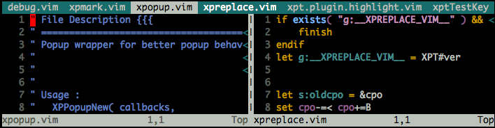

# vim-tabbar

Simple, stupid and fast tab-bar for VIM.

Names of opened buffer are shortened and shows on the top row of window.

Tab button uses one of these three highlight for different states:

-   `TabLineFill`: inactive buffer(**grey text on cyan background**).
-   `TabLine`: in one of the windows but not focused(**white text on dark cyan background**).
-   `TabLineSel`: currently focused buffer(**black text on white background**).



##  Installation

Installing with [pathogen.vim](https://github.com/tpope/vim-pathogen)
 is recommended. Copy and paste:

```sh
cd ~/.vim/bundle
git clone git://github.com/drmingdrmer/vim-tabbar.git
```

Or just copy all of the files in to `~/.vim`.

##  Customizing Colors

Three high light settings in color scheme file(`~/.vim/colors/**.vim`)
are used by this plugin:

```vim
hi TabLineFill cterm=none ctermfg=grey  ctermbg=cyan
hi TabLine     cterm=none ctermfg=white ctermbg=cyan
hi TabLineSel  cterm=none ctermfg=black ctermbg=white
```
